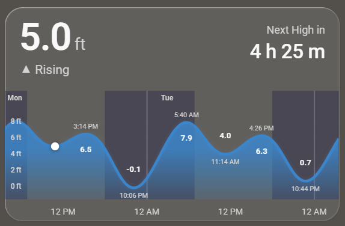

# Tidal Card

A custom Home Assistant Lovelace card that visualizes tide predictions as a smooth SVG curve. Shows current tide height, rising/falling status, countdown to next high or low, day/night shading, moon phase icons, and peak labels -- all rendered inline with no external chart libraries. Designed for a clean, minimal aesthetic inspired by iOS weather widgets.



## Installation

### HACS (recommended)

1. Open HACS in Home Assistant
2. Go to **Frontend** > three-dot menu > **Custom repositories**
3. Add `https://github.com/JoeQuantum/lovelace-tidal-card` with category **Plugin**
4. Search for "Tidal Card" and install
5. Restart Home Assistant

### Manual

1. Download `tidal-card.js` from the [latest release](https://github.com/JoeQuantum/lovelace-tidal-card/releases/latest)
2. Copy to `config/www/tidal-card.js`
3. Add as a resource in **Settings > Dashboards > Resources**:
   - URL: `/local/tidal-card.js`
   - Type: JavaScript Module

## Configuration

| Option | Type | Default | Description |
|--------|------|---------|-------------|
| `entity_hilo` | string | *required* | Sensor with high/low tide predictions (`{t, v, type}` format) |
| `entity_series` | string | *required* | Sensor with 30-min interval tide predictions (`{t, v}` format) |
| `entity_sun` | string | `sun.sun` | Sun entity for day/night shading |
| `chart_hours` | number | `48` | Hours of tide data to display (24-96) |
| `show_moon_phases` | boolean | `true` | Show moon phase icons on the chart |
| `show_day_night` | boolean | `true` | Show day/night shading behind the curve |

### Minimal example

```yaml
type: custom:tidal-card
entity_hilo: sensor.tide_predictions_hilo
entity_series: sensor.tide_predictions_series
```

### Full example

```yaml
type: custom:tidal-card
entity_hilo: sensor.tide_predictions_hilo
entity_series: sensor.tide_predictions_series
entity_sun: sun.sun
chart_hours: 72
show_moon_phases: true
show_day_night: true
```

## Compatible integrations

This card works with any sensor that provides tide predictions in the `{t, v, type}` attribute format. Recommended:

- [**HA_Noaa_Tides**](https://github.com/Flight-Lab/HA_Noaa_Tides) -- NOAA CO-OPS tide predictions for US stations

## Roadmap (v1.1)

- Configurable units (feet / meters)
- Tap action support
- Multiple station overlay
- Tide range event rows
