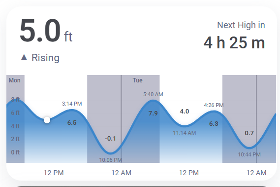

# Tidal Card

A custom Home Assistant Lovelace card that visualizes tide predictions as a smooth SVG curve. Shows current tide height, rising/falling status, countdown to next high or low, day/night shading, moon phase icons, and peak labels -- all rendered inline with no external chart libraries. Designed for a clean, minimal aesthetic inspired by iOS weather widgets.




## Features

- Current tide height with rising/falling indicator and countdown to next event
- Smooth SVG tide curve with water fill gradient
- Day/night shading from sun entity
- Moon phase icons (new, first quarter, full, last quarter)
- Peak high/low labels with collision detection
- Dynamic Y-axis range that adapts to any location
- Horizontal grid lines with height labels
- Dark and light mode support
- Visual config editor (no YAML required)
- 27KB bundle, zero runtime dependencies beyond Lit

## Installation

### HACS (recommended)

1. Open HACS in Home Assistant
2. Go to **Frontend** > three-dot menu > **Custom repositories**
3. Add `https://github.com/JoeQuantum/tidal-card` with category **Dashboard**
4. Search for "Tidal Card" and install
5. Restart Home Assistant

### Manual

1. Download `tidal-card.js` from the [latest release](https://github.com/JoeQuantum/tidal-card/releases/latest)
2. Copy to `config/www/tidal-card.js`
3. Add as a resource in **Settings > Dashboards > Resources**:
   - URL: `/local/tidal-card.js`
   - Type: JavaScript Module

## Configuration

The card has a full visual editor -- just add it from the card picker and configure through the UI. YAML configuration is also supported:

| Option | Type | Default | Description |
|--------|------|---------|-------------|
| `entity_hilo` | string | *required* | Sensor with high/low tide predictions (`{t, v, type}` format) |
| `entity_series` | string | *required* | Sensor with 30-min interval tide predictions (`{t, v}` format) |
| `name` | string | | Optional card title override |
| `entity_sun` | string | `sun.sun` | Sun entity for day/night shading |
| `chart_hours` | number | `48` | Hours of tide data to display (24, 48, 72, or 96) |
| `show_moon_phases` | boolean | `true` | Show moon phase icons on the chart |
| `show_day_night` | boolean | `true` | Show day/night shading behind the curve |

### Minimal example
```yaml
type: custom:tidal-card
entity_hilo: sensor.tide_predictions_hilo
entity_series: sensor.tide_predictions_series
```

### Full example
```yaml
type: custom:tidal-card
entity_hilo: sensor.tide_predictions_hilo
entity_series: sensor.tide_predictions_series
name: Friday Harbor Tides
entity_sun: sun.sun
chart_hours: 72
show_moon_phases: true
show_day_night: true
```

## Data sources

The card needs two sensors: one with the high/low tide peaks (`entity_hilo`) and one with a 30-minute interval series (`entity_series`). Both must expose a `predictions` attribute matching the formats below.

### United States: NOAA REST sensors

NOAA's CO-OPS API serves tide predictions for free with no API key, in the exact format the card expects. The simplest path is two REST sensors in `configuration.yaml` that hit the same endpoint with different `interval` values.

Find your station ID at the [NOAA Tides and Currents map](https://tidesandcurrents.noaa.gov/map/index.html?type=tidepredictions). The example below uses station `9447130` (Seattle) -- replace with your own.

```yaml
# configuration.yaml
sensor:
  - platform: rest
    name: Tide Predictions Series
    resource: https://api.tidesandcurrents.noaa.gov/api/prod/datagetter?product=predictions&station=9447130&date=today&range=96&interval=30&time_zone=lst_ldt&units=english&datum=MLLW&format=json&application=tidal-card
    method: GET
    scan_interval: 3600
    value_template: "OK"
    json_attributes:
      - predictions

  - platform: rest
    name: Tide Predictions Hilo
    resource: https://api.tidesandcurrents.noaa.gov/api/prod/datagetter?product=predictions&station=9447130&date=today&range=96&interval=hilo&time_zone=lst_ldt&units=english&datum=MLLW&format=json&application=tidal-card
    method: GET
    scan_interval: 3600
    value_template: "OK"
    json_attributes:
      - predictions
```

Restart Home Assistant. You'll get `sensor.tide_predictions_series` and `sensor.tide_predictions_hilo` -- point the card at those.

> The [HA_Noaa_Tides](https://github.com/Flight-Lab/HA_Noaa_Tides) integration provides a `Tide Predictions` sensor that exposes the current tide *state* (rising/falling, factor, percentage) -- but **not** the 30-minute interval series the card needs for the smooth curve. The REST sensors above are the current path for US users. Direct NOAA fetch from inside the card itself (no HA sensors required) is on the v1.3 roadmap.

### International integrations (entity mode)

The following integrations expose tide data in formats that can drive the card; some may need a template sensor to reshape the attributes:

- [**worldtidesinfocustom**](https://github.com/jugla/worldtidesinfocustom) -- Global coverage, 8,000+ stations (paid, ~$10/18 years)
- [**HASS-ukho_tides**](https://github.com/ianByrne/HASS-ukho_tides) -- UK, 607 stations (free with API key)
- [**ha-norwegiantide**](https://github.com/tmjo/ha-norwegiantide) -- Norway via Kartverket (free, no key)
- [**marees_france**](https://github.com/KipK/marees_france) -- France via SHOM
- [**moderntides**](https://github.com/ALArvi019/moderntides) -- Spain via IHM (free, no key)
- [**ha-bsh_tides**](https://github.com/EnlightningMan/ha-bsh_tides) -- German North Sea coast

Per-integration compatibility documentation is planned for v1.3.

### Required attribute format

The card reads a `predictions` attribute from each sensor.

For `entity_hilo`, each prediction is `{t, v, type}` where `t` is a local time string `YYYY-MM-DD HH:MM`, `v` is height in feet (string), and `type` is `"H"` or `"L"`.

For `entity_series`, each prediction is `{t, v}` -- same `t` and `v` semantics, no `type`. Intervals should be 30 minutes.

NOAA's API output matches both formats directly. Other integrations may need a template sensor to reshape.

## Roadmap

**v1.1 -- Localization**
- Configurable units (feet/meters) with auto-detection from HA settings
- Locale-aware number formatting, 12h/24h time, translated day names
- UI string translations

**v1.2 -- Visual polish**
- Negative tide emphasis (color change below zero line)
- Responsive layout for narrow cards
- Animated wave icon

**v1.3 -- Standalone NOAA mode**
- Built-in NOAA API fetch (no HA integration required, just a station ID)
- Provider abstraction for community-contributed data sources
- Entity-mode compatibility docs for international integrations

## License

MIT